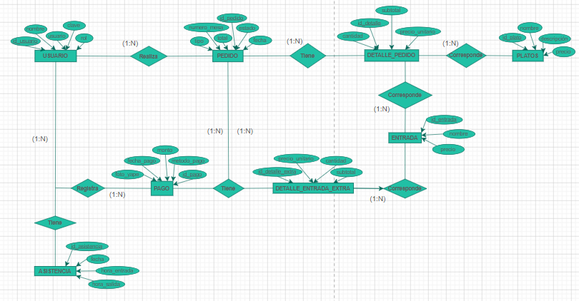
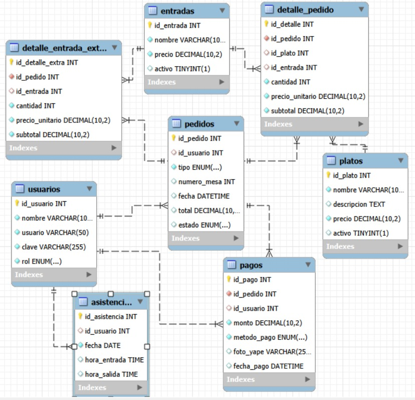

<a href="https://www.figma.com/design/DI0Ip5gNiILjmSuuFt7TbY/PROYECTO-2.0?node-id=0-1&t=ObYHDFb0h2PnhTpA-1">
  <button>
  </button>
</a>
&nbsp;
&nbsp;
&nbsp;
<a href="https://trello.com/invite/b/69a1f85c0ed4e45d0fc17d32/ATTIe2fd04a19811f5b4cfb389993cdd4bc18F42DF2C/restaurante-milagros-proyecto-senati">
  <button>
  </button>
</a>

# SISTEMA WEB DE GESTIÓN PARA UN RESTAURANTE

## DESCRIPCIÓN DEL NEGOCIO
#### NOMBRE: 
RESTAURTANTE "  "Milagros"
#### CONTEXTO:
La empresa se dedica al rubro gastronómico, 
específicamente a la preparación y venta de 
alimentos y bebidas en un restaurante pequeño. 
Su actividad principal consiste en ofrecer distintos 
platos a los clientes, los cuales son solicitados a 
través de los mozos y preparados por el personal 
de cocina para su posterior servicio en las mesas 
del establecimiento. 
El restaurante cuenta con personal como mozos y 
trabajadores de cocina, quienes se encargan de 
tomar los pedidos, preparar los alimentos y atender 
a los clientes dentro del local.

## IDENTIFICAR EL PROBLEMA Y SOLUCIÓN
### PROBLEMA
El restaurante presenta problemas de organización 
en la gestión de pedidos, control del personal y 
registro de ventas. Actualmente los pedidos son 
realizados mediante WHATSAPP, pero igual se 
genera mucha confusión entre los mozos y la 
cocina, no existe un control claro de asistencia del 
personal y el cajero no cuenta con un registro 
organizado de las ganancias diarias. 
Además, cuando un plato se termina, no existe un 
sistema que lo elimine automáticamente de la lista 
de pedidos, lo que puede generar errores al 
momento de tomar las órdenes. 

### SOLUCIÓN
Desarrollar un sistema digital que 
permita gestionar los pedidos del 
restaurante, controlar la asistencia del 
personal, organizar la preparación de 
los platos en cocina y llevar un 
registro claro de las ventas y 
ganancias del negocio. 
&nbsp;
&nbsp;
<details>
<summary>REQUERIMIENTOS FUNCIONALES Y NO FUNCIONALES</summary>

## REQUERIMIENTOS FUNCIONALES
|  Usuarios  |  Pedidos  |  Platos / Entradas  |  Detalle pedido  |  Pagos  |  Asistencia  |
| ------------- | ------------- | ------------- | ------------- | ------------- | ------------- |
|  El sistema debe permitir registrar nuevos usuarios con nombre, usuario, clave y rol  |  El sistema debe permitir crear un pedido indicando tipo (mesa o para llevar) y número de mesa  |  El sistema debe permitir registrar platos con nombre, descripción y precio  |  El sistema debe permitir agregar platos y entradas a un pedido existente  |  El sistema debe registrar el pago de un pedido indicando monto y método de pago  |  El sistema debe registrar la hora de entrada del empleado cada día  |
|  El sistema debe permitir editar los datos de un usuario existente  |  El sistema debe permitir cambiar el estado del pedido (pendiente, en proceso, entregado, cancelado)  |  El sistema debe permitir registrar entradas con nombre y precio  |  El sistema debe calcular automáticamente el subtotal por ítem (cantidad × precio unitario)  |  El sistema debe permitir registrar pagos con foto del comprobante para el método Yape  |  El sistema debe registrar la hora de salida del empleado  |
|  El sistema debe permitir activar o desactivar usuarios según su estado laboral  |  El sistema debe calcular el total del pedido a partir de sus detalles  |  El sistema debe permitir activar o desactivar platos y entradas del menú  |  El sistema debe permitir agregar entradas extra a un pedido ya registrado  |  El sistema debe asociar cada pago al usuario que lo registró  |  El sistema debe permitir consultar el historial de asistencia por empleado y fecha  |
|  El sistema debe autenticar al usuario con su usuario y clave para acceder al sistema  |  El sistema debe permitir consultar pedidos por fecha, estado o número de mesa  |  El sistema debe mostrar solo los platos y entradas activos al momento de crear un pedido  |  El sistema debe calcular el subtotal de las entradas extra por separado  |  El sistema debe permitir consultar todos los pagos asociados a un pedido  |  El sistema debe calcular el tiempo trabajado por empleado por día  |

## REQUERIMIENTOS NO FUNCIONALES
| SEGURIDAD | RENDIMIENTO | USABILIDAD | MANTENIBILIDAD |
| ------------- | ------------- | ------------- | ------------- |
| Las contraseñas deben almacenarse cifradas en la base de datos | El sistema debe responder en menos de 3 segundos | La interfaz debe ser sencilla e intuitiva para los empleados | El sistema debe estar desarrollado bajo arquitectura MVC |
| El sistema debe restringir el acceso según el rol (administrador, mozo, cocina) | El sistema debe permitir varios usuarios conectados al mismo tiempo | El sistema debe ser accesible desde cualquier navegador web | La base de datos debe estar normalizada |
| El sistema debe cerrar sesión automáticamente por inactividad | Los pedidos deben actualizarse en tiempo real | El sistema debe mostrar mensajes claros cuando ocurra un error | El sistema debe permitir futuras mejoras o actualizaciones |


</details>
&nbsp;
&nbsp;
<details>
<summary>DIAGRAMAS</summary>
	
### CARDINALIDADES
- USUARIO Realiza PEDIDO (1:N) Un usuario puede hacer muchos pedidos.
  
- USUARIO Tiene ASISTENCIA (1:N) Un usuario tiene muchos registros de asistencia (uno por día). Cada asistencia pertenece a un solo usuario.
  
- USUARIO Registra PAGO (1:N)	Un usuario (mesero) puede registrar varios pagos. Cada pago fue registrado por un solo usuario.
  
- PEDIDO Tiene DETALLE_PEDIDO (1:N) Un pedido tiene uno o más ítems (platos/entradas). Cada detalle pertenece a un único pedido.
  
- PEDIDO Tiene DETALLE_ENTRADA_EXTRA (1:N) Un pedido puede tener varias entradas extra adicionales. Cada extra corresponde a un solo pedido.

- PEDIDO genera PAGO (1:N) Un pedido puede generar varios registros de pago. Cada pago referencia un solo pedido.

- PLATO Corresponde DETALLE_PEDIDO (1:N) Un plato puede estar en muchos detalles (pedidos distintos). Cada detalle referencia un plato.

- ENTRADA Corresponde DETALLE_PEDIDO (1:N) Una entrada puede aparecer en varios detalles. Cada detalle puede referenciar una entrada.

- ENTRADA Corresponde DETALLE_ENTRADA_EXTRA (1:N) Una entrada puede pedirse como extra en muchos pedidos. Cada registro extra referencia una sola entrada.

<summary> DIAGRAMA ENTIDAD RELACIÓN (DER)</summary>


<summary> DIAGRAMA RELACIONAL (MR)</summary>


</details>
&nbsp;
&nbsp;
<details>
<summary> BASE DE DATOS </summary>
  
``` mysql
CREATE DATABASE restaurante_db_2;
USE restaurante_db_2;

CREATE TABLE usuario (
    id_usuario INT AUTO_INCREMENT PRIMARY KEY,
    nombre VARCHAR(100) NOT NULL,
    usuario VARCHAR(50) UNIQUE NOT NULL,
    clave VARCHAR(255) NOT NULL,
    rol ENUM('admin','mesero','cocina') NOT NULL
) ENGINE=InnoDB DEFAULT CHARSET=utf8mb4 COLLATE=utf8mb4_spanish_ci;

CREATE TABLE entrada (
    id_entrada INT AUTO_INCREMENT PRIMARY KEY,
    nombre VARCHAR(100) NOT NULL,
    precio DECIMAL(10,2) NOT NULL DEFAULT 0,
    activo BOOLEAN DEFAULT TRUE
) ENGINE=InnoDB DEFAULT CHARSET=utf8mb4 COLLATE=utf8mb4_spanish_ci;

CREATE TABLE plato (
    id_plato INT AUTO_INCREMENT PRIMARY KEY,
    nombre VARCHAR(100) NOT NULL,
    descripcion TEXT,
    precio DECIMAL(10,2) NOT NULL,
	activo BOOLEAN DEFAULT TRUE
) ENGINE=InnoDB DEFAULT CHARSET=utf8mb4 COLLATE=utf8mb4_spanish_ci;

CREATE TABLE pedido (
    id_pedido INT AUTO_INCREMENT PRIMARY KEY,
    id_usuario INT DEFAULT NULL,
    tipo ENUM('Mesa','Llevar') NOT NULL,
    numero_mesa INT NULL,
    fecha DATETIME DEFAULT CURRENT_TIMESTAMP,
    total DECIMAL(10,2) DEFAULT 0,
    estado ENUM('Pendiente','Preparando','Entregado','Pagado','Cancelado') DEFAULT 'Pendiente',
    FOREIGN KEY (id_usuario) REFERENCES usuario(id_usuario) ON DELETE SET NULL
) ENGINE=InnoDB DEFAULT CHARSET=utf8mb4 COLLATE=utf8mb4_spanish_ci;

CREATE TABLE detalle_pedido (
    id_detalle INT AUTO_INCREMENT PRIMARY KEY,
    id_pedido INT NOT NULL,
    id_plato INT DEFAULT NULL,
    id_entrada INT DEFAULT NULL,
    cantidad INT NOT NULL DEFAULT 1,
    precio_unitario DECIMAL(10,2) NOT NULL,
    subtotal DECIMAL(10,2) NOT NULL,
    FOREIGN KEY (id_pedido) REFERENCES pedido(id_pedido) ON DELETE RESTRICT,
    FOREIGN KEY (id_plato) REFERENCES plato(id_plato) ON DELETE SET NULL,
    FOREIGN KEY (id_entrada) REFERENCES entrada(id_entrada) ON DELETE SET NULL
) ENGINE=InnoDB DEFAULT CHARSET=utf8mb4 COLLATE=utf8mb4_spanish_ci;

CREATE TABLE detalle_entrada_extra (
    id_detalle_extra INT AUTO_INCREMENT PRIMARY KEY,
    id_pedido INT NOT NULL,
    id_entrada INT DEFAULT NULL,
    cantidad INT NOT NULL DEFAULT 1,
    precio_unitario DECIMAL(10,2) NOT NULL,
    subtotal DECIMAL(10,2) NOT NULL,
    FOREIGN KEY (id_pedido)REFERENCES pedido(id_pedido) ON DELETE RESTRICT,
    FOREIGN KEY (id_entrada) REFERENCES entrada(id_entrada) ON DELETE SET NULL
) ENGINE=InnoDB DEFAULT CHARSET=utf8mb4 COLLATE=utf8mb4_spanish_ci;

CREATE TABLE pago (
    id_pago INT AUTO_INCREMENT PRIMARY KEY,
    id_pedido INT NOT NULL,
    id_usuario INT DEFAULT NULL,
    monto DECIMAL(10,2) NOT NULL,
    metodo_pago ENUM('Efectivo','Yape') NOT NULL,
    foto_yape VARCHAR(255) DEFAULT NULL,
    fecha_pago DATETIME DEFAULT CURRENT_TIMESTAMP,
    FOREIGN KEY (id_pedido) REFERENCES pedido(id_pedido) ON DELETE RESTRICT,
    FOREIGN KEY (id_usuario) REFERENCES usuario(id_usuario)ON DELETE SET NULL
) ENGINE=InnoDB DEFAULT CHARSET=utf8mb4 COLLATE=utf8mb4_spanish_ci;

CREATE TABLE asistencia (
    id_asistencia INT AUTO_INCREMENT PRIMARY KEY,
    id_usuario INT DEFAULT NULL,
    fecha DATE NOT NULL,
    hora_entrada TIME,
    hora_salida TIME,
    FOREIGN KEY (id_usuario) REFERENCES usuario(id_usuario)ON DELETE SET NULL
) ENGINE=InnoDB DEFAULT CHARSET=utf8mb4 COLLATE=utf8mb4_spanish_ci;
```
</details>
&nbsp;
&nbsp;

<details>
<summary>IMAGENES DEL NEGOCIO</summary>

&nbsp;&nbsp;&nbsp;
<video src="https://github.com/user-attachments/assets/646bb3ee-729c-4340-951f-e4a97e5edfee" width="200" controls style="vertical-align: middle;"></video>

</details>


