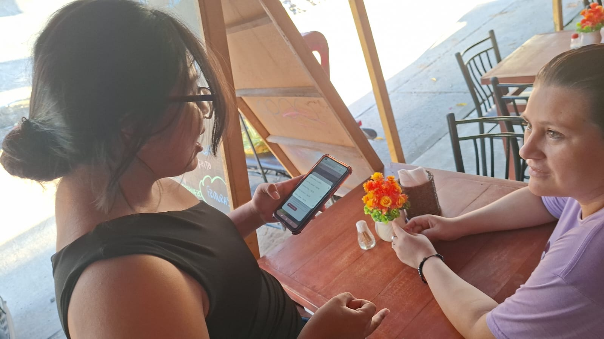

<a href="https://www.figma.com/design/DI0Ip5gNiILjmSuuFt7TbY/PROYECTO-2.0?node-id=0-1&t=ObYHDFb0h2PnhTpA-1">
  <button>
  </button>
</a>
&nbsp;
&nbsp;
<a href="https://trello.com/invite/b/69a1f85c0ed4e45d0fc17d32/ATTIe2fd04a19811f5b4cfb389993cdd4bc18F42DF2C/restaurante-milagros-proyecto-senati">
  <button>
  </button>
</a>

# SISTEMA WEB DE GESTIÓN PARA UN RESTAURANTE

## DESCRIPCIÓN DEL NEGOCIO
#### NOMBRE: 
RESTAURTANTE "  "Milagros"
#### CONTEXTO:
La empresa se dedica al rubro gastronómico, 
específicamente a la preparación y venta de 
alimentos y bebidas en un restaurante pequeño. 
Su actividad principal consiste en ofrecer distintos 
platos a los clientes, los cuales son solicitados a 
través de los mozos y preparados por el personal 
de cocina para su posterior servicio en las mesas 
del establecimiento. 
El restaurante cuenta con personal como mozos y 
trabajadores de cocina, quienes se encargan de 
tomar los pedidos, preparar los alimentos y atender 
a los clientes dentro del local.

## IDENTIFICAR EL PROBLEMA Y SOLUCIÓN
### PROBLEMA
El restaurante presenta problemas de organización 
en la gestión de pedidos, control del personal y 
registro de ventas. Actualmente los pedidos son 
realizados mediante WHATSAPP, pero igual se 
genera mucha confusión entre los mozos y la 
cocina, no existe un control claro de asistencia del 
personal y el cajero no cuenta con un registro 
organizado de las ganancias diarias. 
Además, cuando un plato se termina, no existe un 
sistema que lo elimine automáticamente de la lista 
de pedidos, lo que puede generar errores al 
momento de tomar las órdenes. 

### SOLUCIÓN
Desarrollar un sistema digital que 
permita gestionar los pedidos del 
restaurante, controlar la asistencia del 
personal, organizar la preparación de 
los platos en cocina y llevar un 
registro claro de las ventas y 
ganancias del negocio. 
&nbsp;
&nbsp;
<details>
<summary>REQUERIMIENTOS FUNCIONALES Y NO FUNCIONALES</summary>

</details>
&nbsp;
&nbsp;
<details>
<summary>DIAGRAMAS</summary>
  
<summary> DIAGRAMA ENTIDAD RELACIÓN (DER)</summary>


<summary> DIAGRAMA RELACIONAL (MR)</summary>


</details>
&nbsp;
&nbsp;
<details>
<summary> BASE DE DATOS </summary>
  
``` mysql
CREATE DATABASE restaurante_db;
USE restaurante_db;

CREATE TABLE usuarios (
    id_usuario  INT AUTO_INCREMENT PRIMARY KEY,
    nombre      VARCHAR(100) NOT NULL,
    usuario     VARCHAR(50) UNIQUE NOT NULL,
    clave  VARCHAR(255) NOT NULL,
    rol         ENUM('admin','mesero','cocina') NOT NULL
) ENGINE=InnoDB DEFAULT CHARSET=utf8mb4 COLLATE=utf8mb4_spanish_ci;

CREATE TABLE entradas (
    id_entrada  INT AUTO_INCREMENT PRIMARY KEY,
    nombre      VARCHAR(100) NOT NULL,
    precio      DECIMAL(10,2) NOT NULL DEFAULT 0
) ENGINE=InnoDB DEFAULT CHARSET=utf8mb4 COLLATE=utf8mb4_spanish_ci;

CREATE TABLE platos (
    id_plato    INT AUTO_INCREMENT PRIMARY KEY,
    nombre      VARCHAR(100) NOT NULL,
    descripcion TEXT,
    precio      DECIMAL(10,2) NOT NULL,
    disponible  ENUM('disponible','no disponible') not null
) ENGINE=InnoDB DEFAULT CHARSET=utf8mb4 COLLATE=utf8mb4_spanish_ci;

CREATE TABLE pedidos (
    id_pedido    INT AUTO_INCREMENT PRIMARY KEY,
    id_usuario   INT DEFAULT NULL,               
    tipo         ENUM('Mesa','Llevar') NOT NULL,
    numero_mesa  INT NULL,                       
    fecha        DATETIME DEFAULT CURRENT_TIMESTAMP,
    total        DECIMAL(10,2) DEFAULT 0,
    estado       ENUM('Pendiente','Preparando','Entregado','Pagado') DEFAULT 'Pendiente',
    FOREIGN KEY (id_usuario) REFERENCES usuarios(id_usuario) ON DELETE SET NULL
) ENGINE=InnoDB DEFAULT CHARSET=utf8mb4 COLLATE=utf8mb4_spanish_ci;

CREATE TABLE detalle_pedido (
    id_detalle       INT AUTO_INCREMENT PRIMARY KEY,
    id_pedido        INT DEFAULT NULL,
    tipo_item        ENUM('Plato','Entrada Adicional') NOT NULL,
    id_plato         INT DEFAULT NULL,
    id_entrada       INT DEFAULT NULL,
    id_entrada_extra INT DEFAULT NULL,  
    cantidad         INT NOT NULL DEFAULT 1,
    precio_unitario  DECIMAL(10,2) NOT NULL,
    subtotal         DECIMAL(10,2) NOT NULL,
    FOREIGN KEY (id_pedido)        REFERENCES pedidos(id_pedido)   ON DELETE SET NULL,
    FOREIGN KEY (id_plato)         REFERENCES platos(id_plato)     ON DELETE SET NULL,
    FOREIGN KEY (id_entrada)       REFERENCES entradas(id_entrada) ON DELETE SET NULL,
    FOREIGN KEY (id_entrada_extra) REFERENCES entradas(id_entrada) ON DELETE SET NULL
) ENGINE=InnoDB DEFAULT CHARSET=utf8mb4 COLLATE=utf8mb4_spanish_ci;

CREATE TABLE pagos (
    id_pago      INT AUTO_INCREMENT PRIMARY KEY,
    id_pedido    INT DEFAULT NULL,
    id_usuario   INT DEFAULT NULL,
    monto        DECIMAL(10,2) NOT NULL,
    metodo_pago  ENUM('Efectivo','Yape'),
    foto_yape    VARCHAR(255) DEFAULT NULL,
    fecha_pago   DATETIME DEFAULT CURRENT_TIMESTAMP,
    FOREIGN KEY (id_pedido)  REFERENCES pedidos(id_pedido)   ON DELETE SET NULL,
    FOREIGN KEY (id_usuario) REFERENCES usuarios(id_usuario) ON DELETE SET NULL
) ENGINE=InnoDB DEFAULT CHARSET=utf8mb4 COLLATE=utf8mb4_spanish_ci;

CREATE TABLE asistencias (
    id_asistencia INT AUTO_INCREMENT PRIMARY KEY,
    id_usuario    INT DEFAULT NULL,
    fecha         DATE NOT NULL,
    hora_entrada  TIME,
    hora_salida   TIME,
    FOREIGN KEY (id_usuario) REFERENCES usuarios(id_usuario) ON DELETE SET NULL
) ENGINE=InnoDB DEFAULT CHARSET=utf8mb4 COLLATE=utf8mb4_spanish_ci;
```
</details>
&nbsp;
&nbsp;

<details>
<summary>IMAGENES DEL NEGOCIO</summary>

&nbsp;&nbsp;&nbsp;<video src="[recursos-git/prueba3.gif](https://github.com/user-attachments/assets/646bb3ee-729c-4340-951f-e4a97e5edfee
)" width="400" controls style="vertical-align: middle;"></video>

</details>


